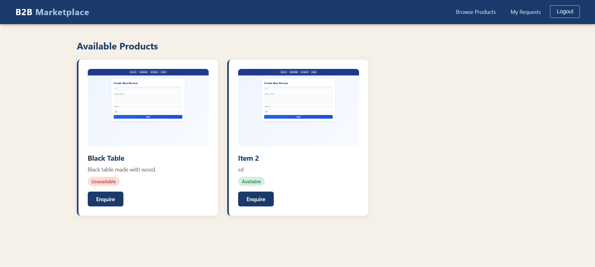
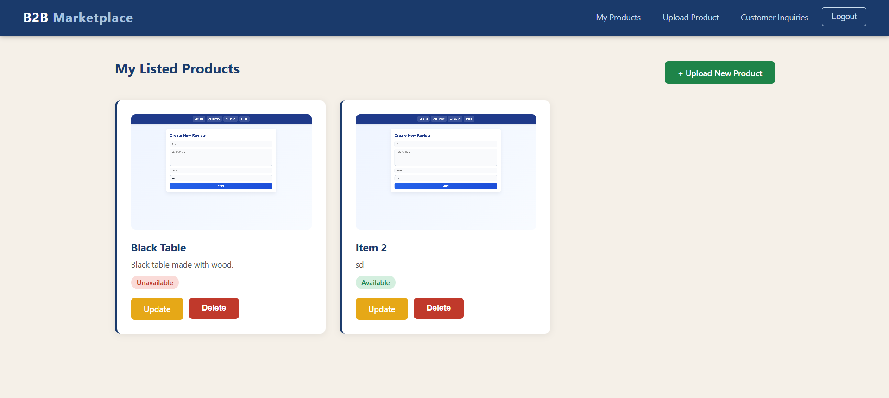
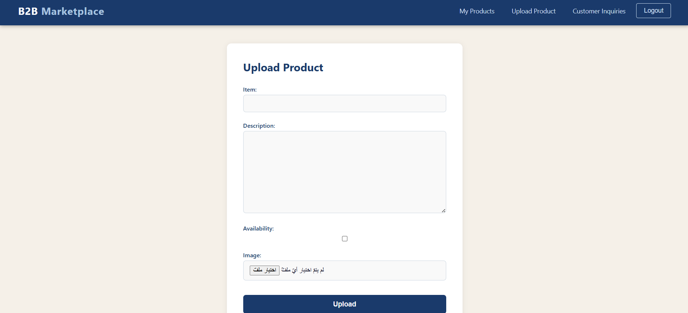

# B2B Marketplace #

## Date 5/7/2026 ##

### By: Hasan Mahfoodh | Ali Hasasn ###

#### [Hasan's LinkedIn](www.linkedin.com/in/hasan-mahfoodh) | [Hasan's GitHub](https://github.com/v7sn0) ####
#### [Ali's LinkedIn](https://www.linkedin.com/in/alihasan24/) | [Ali's GitHub](https://github.com/alooyu24) ####

***
### Description ###
A website that allows the suppliers to list their products, where then the businesses can directly request to purchase these products from them.

***

### Technologies ###

* Django
* PostrgeSQL

***

### Getting Started ###
*  Open the website and choose to signup ass a customer or a supplier.
    * For customers: Login in the website and enquire products, and see your inquiries status.
    *  For suppliers: Login in the website and upload products, and answer customers inquiries.
***

### Screenshots ###

**Customer's main page**
  

  **Supplier's main page**
  

  **Customer's uploading product page**
  
  

***

### Task List ###
- [x] Completing the models.
- [x] Completing the frontend and the backend.
- [ ] Deploying the project.

### Credits ###

-
